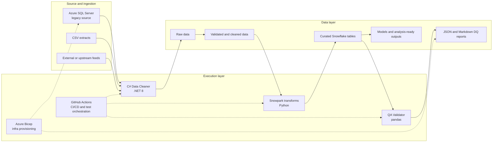

# Contoso Bank Loan Data Modernization Lab

[](https://github.com/auto-cloud-arc/loan-data-lab/actions/workflows/ci.yml)
[](https://github.com/auto-cloud-arc/loan-data-lab/actions/workflows/validate-data-quality.yml)

A GitHub Copilot workshop repository built around **modernizing Contoso Bank's loan onboarding and data quality pipeline** from Azure SQL Server to Snowflake.

## Business story

Contoso Bank processes daily loan application extracts with real-world data quality issues: nulls, malformed phone numbers, invalid state codes, duplicate customer IDs, and future application dates. This repo demonstrates the full journey:

```text
Azure SQL Server (legacy)
        ↓
  C# Data Cleaner  (normalize, validate, report exceptions)
        ↓
   Snowflake / Snowpark  (transform into curated tables)
        ↓
   QA Validator  (enforce business rules, produce DQ report)
```

## Business challenge

- Legacy problem: daily loan extracts arrive with nulls, malformed data, duplicates, and invalid or future-dated records.
- Goal: modernize the onboarding and data quality pipeline from Azure SQL Server to Snowflake while making validation, testing, and automation explicit.

## Architecture and data flow




### End-to-end flow

#### Ingestion and cleaning

- Source systems include Azure SQL Server, CSV extracts, and upstream feeds.
- The C# .NET 8 data cleaner normalizes fields, validates records, and reports exceptions such as nulls, invalid dates, malformed fields, and duplicates.

#### Transformation and curation

- Snowflake on Azure is the modern target platform.
- Snowpark Python jobs transform cleaned records into curated tables for downstream consumption.

#### Quality assurance

- The Python QA validator enforces business and reconciliation rules on curated datasets.
- Output artifacts include machine-readable JSON reports and human-readable Markdown summaries.

#### Reporting and analysis

- The pipeline produces curated tables, analysis-ready outputs, validation reports, and workshop-friendly artifacts for demos and review.

## Architecture layers

- Execution layer: GitHub Actions, test orchestration, pipeline code, and infrastructure provisioning coordinate the flow.
- Data layer: data moves from raw to validated to curated datasets, then into reports and analysis-ready outputs.
- Tooling layer: C# cleaner, Snowpark, QA validator, and Azure Bicep provide the implementation backbone.

## Repository structure

```text
.
├── .github/           # CI/CD workflows, issue templates, PR template, agent definitions
├── .copilot/          # Prompt files for workshop
├── docs/              # Architecture, domain story, data contracts, demo script
├── infra/bicep/       # Azure Bicep IaC (SQL Server, Key Vault, Storage)
├── src/
│   ├── data-cleaner-csharp/   # .NET 8 C# console app
│   ├── web-ui/                # Streamlit web UI for manual pipeline testing
│   ├── sqlserver/             # Azure SQL schema, seed, stored procs
│   ├── snowflake/             # Snowflake DDL, stages, procedures, roles
│   ├── snowpark/              # Python Snowpark transforms + tests
│   └── qa-validator/          # Python QA validation rules + tests
├── sample-data/       # Raw, cleaned, and expected data files
└── copilot-instructions.md
```

## Quick start

### C# Data Cleaner

```bash
cd src/data-cleaner-csharp
dotnet restore ContosoLoanCleaner.sln
dotnet build ContosoLoanCleaner.sln
dotnet run --project ContosoLoanCleaner -- ../../sample-data/raw/loan_applications_raw.csv ../../sample-data/cleaned/loan_applications_cleaned.csv
dotnet test ContosoLoanCleaner.sln
```

### QA Validator

```bash
pip install pandas pytest
pytest src/qa-validator/tests/ -v
python src/qa-validator/runners/run_validations.py \
  --input sample-data/cleaned/loan_applications_cleaned.csv \
  --report-dir reports/
```

#### QA Rule Coverage and Report Outputs

The QA validator enforces banking-focused rules for curated loan data quality:

- Null business keys: `application_id`, `customer_id`, `branch_code`
- Invalid/future application dates
- Negative or non-numeric loan amounts
- Missing collateral for secured products (`MORTGAGE`, `AUTO`, `HELOC`)
- Source-to-target row count reconciliation with configurable tolerance

Implementation sources:

- Null key checks: [src/qa-validator/rules/null_check_rules.py](src/qa-validator/rules/null_check_rules.py)
- Date checks: [src/qa-validator/rules/date_validation_rules.py](src/qa-validator/rules/date_validation_rules.py)
- Business checks: [src/qa-validator/rules/business_rules.py](src/qa-validator/rules/business_rules.py)
- Reconciliation checks: [src/qa-validator/rules/reconciliation_rules.py](src/qa-validator/rules/reconciliation_rules.py)
- Report writers (JSON + Markdown): [src/qa-validator/reports/report_generator.py](src/qa-validator/reports/report_generator.py)
- Validation runner orchestration and CLI args: [src/qa-validator/runners/run_validations.py](src/qa-validator/runners/run_validations.py)

Optional reconciliation arguments:

```bash
python src/qa-validator/runners/run_validations.py \
     --input sample-data/cleaned/loan_applications_cleaned.csv \
     --report-dir reports/ \
     --source-count 10 \
     --target-count 9 \
     --reconciliation-table loan_application_curated \
     --reconciliation-tolerance 0.01
```

Generated outputs:

- `qa_report_YYYYMMDD_HHMMSS.json`: structured machine-readable DQ report
- `qa_report_YYYYMMDD_HHMMSS.md`: human-readable validation summary

Exit behavior:

- Exit code `0`: no critical validation failures and reconciliation passed
- Exit code `1`: critical validation failures and/or reconciliation failure

### Snowpark Tests (local, no Snowflake required)

```bash
pip install pytest pytest-mock
pytest src/snowpark/tests/ -v
```

### Web UI for manual testing

```bash
python -m venv .venv
.venv\Scripts\activate
python -m pip install --upgrade pip
python -m pip install -r src/web-ui/requirements.txt
dotnet restore src/data-cleaner-csharp/ContosoLoanCleaner.sln
dotnet build src/data-cleaner-csharp/ContosoLoanCleaner.sln
python -m streamlit run src/web-ui/app.py
```

Use `python -m streamlit` to avoid PATH issues on Windows shells where `streamlit` may not be available as a standalone command.

The app starts a local Streamlit server and typically prints a URL such as `http://localhost:8501`.

When the UI opens, start with the bundled sample data in `sample-data/raw/` to verify the end-to-end cleaner and QA flow before trying uploads.

The web UI lets you:

- run the C# cleaner and QA validator end to end from a browser
- test with the bundled sample CSV or upload your own raw loan CSV
- inspect cleaner exceptions and QA failures
- download cleaned CSV, JSON QA output, and Markdown QA summaries

## Outputs and artifacts

- Cleaned data files under `sample-data/cleaned/`
- Curated Snowflake tables built through Snowpark transformations
- Validation reports in JSON and Markdown formats from the QA validator
- Analysis-ready outputs for dashboards, demos, and downstream reporting

## Workshop demo steps

1. **Onboard** — Ask Copilot to explain the architecture and data flow
2. **Plan Mode** — Use Copilot Plan Mode to design the borrower intake workflow
3. **C# generation** — Generate the data cleaning console app
4. **Refactor** — Improve the generated code with Copilot suggestions
5. **Unit testing** — Generate xUnit and pytest test suites
6. **Azure SQL** — Seed and query the legacy source tables
7. **Snowpark** — Write and run transformation jobs
8. **QA Validator** — Create and run validation rules
9. **Debug** — Trace a failing pipeline stage with Copilot
10. **Agents** — Use custom agents from `.github/agents/` and prompts from `.copilot/prompts/` and `.github/prompts/`

See [docs/demo-script.md](docs/demo-script.md) for the full step-by-step guide.

## Copilot Workshop Features

| Feature | Location |
| ------- | -------- |
| Custom prompt: Snowpark transform | `.copilot/prompts/create-snowpark-transform.prompt.md` |
| Custom prompt: Validator rule | `.copilot/prompts/generate-validator-rule.prompt.md` |
| Custom prompt: Legacy SQL explain | `.copilot/prompts/explain-legacy-sql-to-modern-sql.prompt.md` |
| Custom prompt: C# cleaner implementation | `.github/prompts/implement-csharp-cleaner.prompt.md` |
| Data Engineer Agent | `.github/agents/data-engineer.agent.md` |
| QA Validator Agent | `.github/agents/qa-validator.agent.md` |
| Secure Code Reviewer Agent | `.github/agents/secure-code-reviewer.agent.md` |
| Documentation Updater Agent | `.github/agents/documentation-updater.agent.md` |
| Product Docs Agent | `.github/agents/product-docs.agent.md` |
| Repo-level Copilot instructions | `copilot-instructions.md` |

## Documentation

- [Architecture Overview](docs/architecture.md)
- [Domain Story](docs/domain-story.md)
- [Data Contracts](docs/data-contracts.md)
- [Onboarding Guide](docs/onboarding-guide.md)
- [Azure Deployment Runbook](docs/azure-deployment-runbook.md)
- [Demo Script](docs/demo-script.md)
- [Product Requirements Document](docs/prd-loan-data-modernization-lab.md)

## Technology stack

| Component | Technology |
| --------- | ---------- |
| Data cleaning | C# .NET 8, CsvHelper, Serilog |
| Legacy source | Azure SQL Server |
| Modern target | Snowflake on Azure |
| Transformation | Snowpark Python |
| QA validation | Python, pandas |
| Infrastructure | Azure Bicep |
| CI/CD | GitHub Actions |
| Testing | xUnit (.NET), pytest (Python) |
